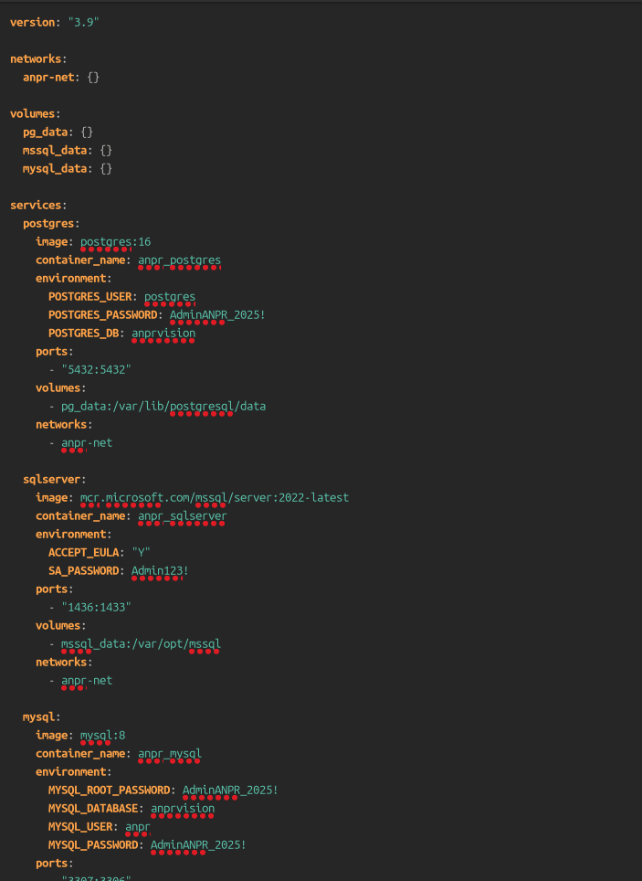
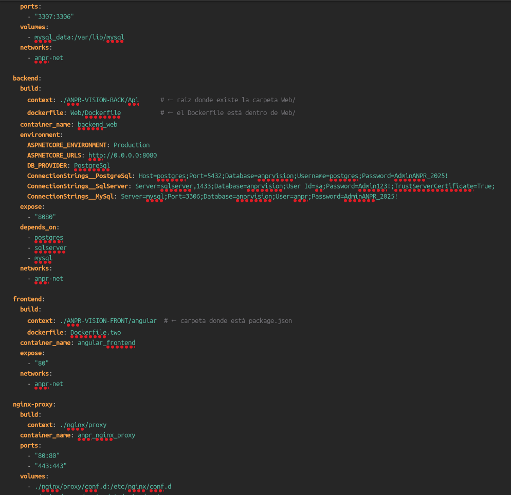
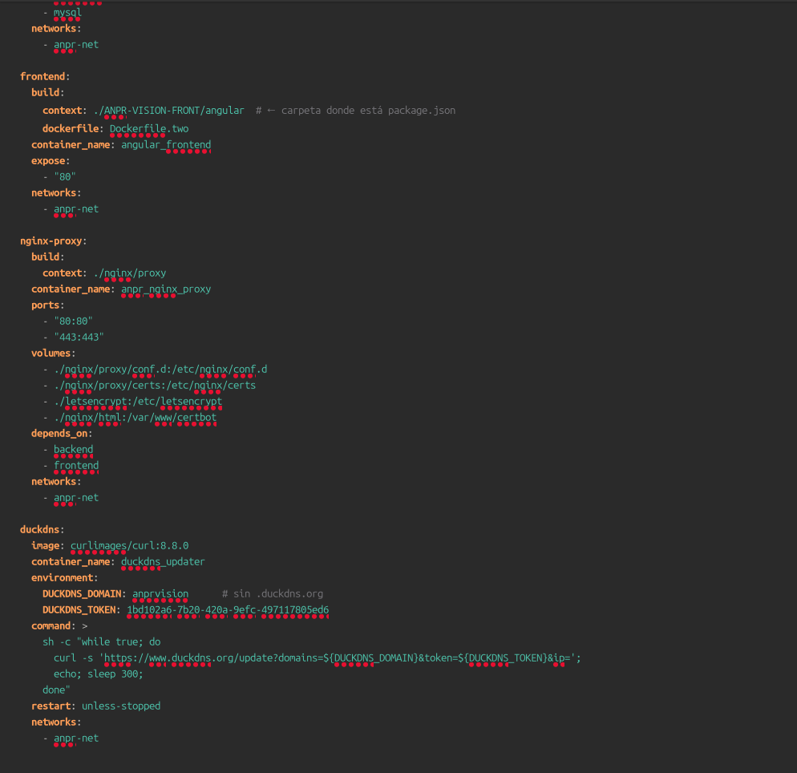
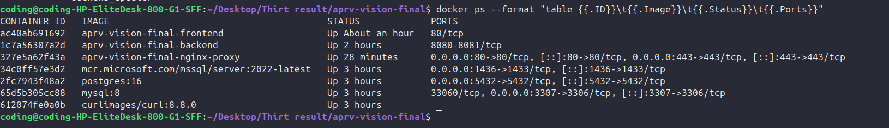
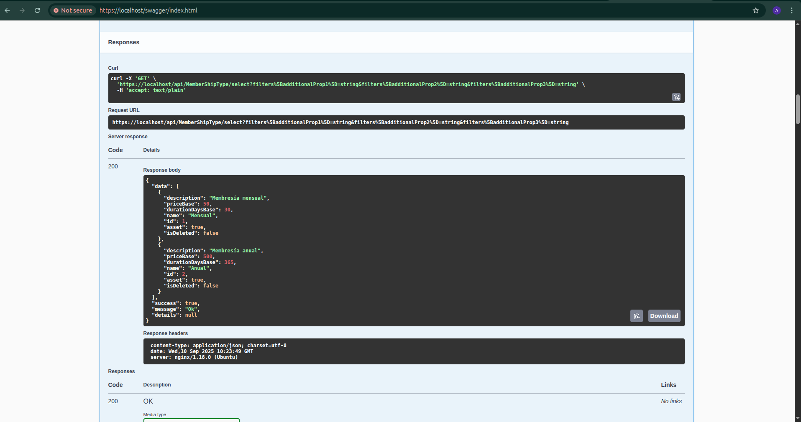
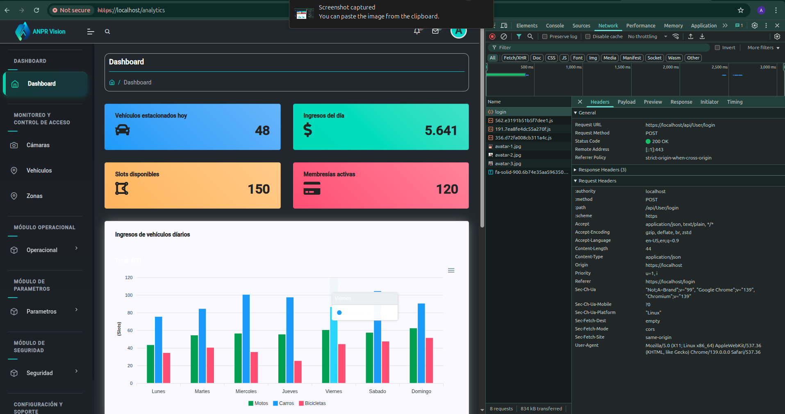

# Despliegue ANPR-VISION con Docker Compose

## 1. Introducción

Este documento explica el proceso de despliegue de **ANPR-VISION** usando Docker Compose.

Incluye:
- Backend en .NET 9
- Frontend en Angular
- Bases de datos PostgreSQL, SQL Server y MySQL
- Nginx como reverse proxy
- Certificados SSL (autofirmados y con Let's Encrypt en DuckDNS)

---

## 2. Preparación del `docker-compose.yml`

Se definieron los siguientes servicios:
- `backend`: Web API .NET 9
- `frontend`: Angular compilado y servido por Nginx
- `postgres`, `sqlserver`, `mysql`: bases de datos
- `nginx-proxy`: reverse proxy con soporte HTTPS
- `duckdns`: actualiza la IP pública con DuckDNS





---

## 3. Construcción y despliegue

Se construyen las imágenes y se levantan los contenedores:

```bash
docker compose build
docker compose up -d
```



---

## 4. Verificación de servicios

- **Frontend**: https://localhost
- **Backend (Swagger)**: https://localhost/swagger/index.html
- **API (ejemplo)**: https://localhost/api/User

📸 **(Insertar captura de Swagger funcionando)**



📸 **(Insertar captura del frontend cargando)**



---

## 5. Certificados SSL

### 5.1. Autofirmado (desarrollo local)

Se generó un certificado autofirmado para pruebas:

```bash
#!/usr/bin/env bash
mkdir -p nginx/proxy/certs
openssl req -x509 -nodes -days 365 \
  -newkey rsa:2048 \
  -keyout nginx/proxy/certs/privkey.pem \
  -out nginx/proxy/certs/fullchain.pem \
  -subj "/CN=localhost"
```

### 5.2. Let's Encrypt con DuckDNS

Para el dominio público anprvision.duckdns.org, se configuró Nginx y Certbot:

```nginx
# HTTP con soporte para ACME (HTTP-01)
server {
  listen 80;
  server_name anprvision.duckdns.org;

  location /.well-known/acme-challenge/ {
    root /var/www/certbot;
  }

  return 301 https://$host$request_uri;
}

# HTTPS con Let's Encrypt
server {
  listen 443 ssl http2;
  server_name anprvision.duckdns.org;

  ssl_certificate     /etc/letsencrypt/live/anprvision.duckdns.org/fullchain.pem;
  ssl_certificate_key /etc/letsencrypt/live/anprvision.duckdns.org/privkey.pem;

  location /api/ {
    proxy_pass http://backend:8080;
  }

  location / {
    proxy_pass http://frontend:80;
  }
}
```

#### Emisión del certificado

```bash
docker run --rm \
  -v $(pwd)/letsencrypt:/etc/letsencrypt \
  -v $(pwd)/nginx/html:/var/www/certbot \
  certbot/certbot certonly --webroot \
  -w /var/www/certbot \
  -d anprvision.duckdns.org \
  --agree-tos -m tu-email@dominio.com --non-interactive
```

---

## 6. Conclusión

Con esta configuración:

- El frontend y backend corren dentro de Docker, sin dependencias externas.
- Se soportan múltiples bases de datos para pruebas.
- Nginx centraliza el tráfico con HTTPS.
- DuckDNS + Let's Encrypt permiten exponer el sistema públicamente con un certificado válido.
